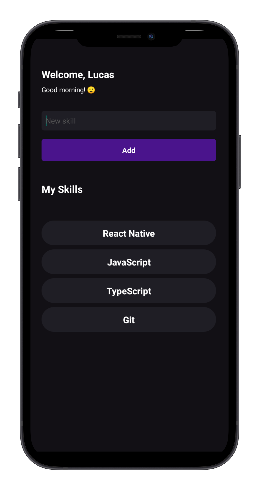

# Skills

## 💻 Project

This is a project that works on the **core concepts** of react, to add skills according to the programmer's abilities.

## 📸 Screenshot



## 🚀 Technologies

- [React Native](https://reactnative.dev/)

## 📝 Instructions

```bash
# Clone this repository
$ git clone git@github.com:lucalves/rocketseat/myskills.git

# Access the repository directory
$ cd myskills

# Open repository in your IDE
$ code .

# Install dependencies with yarn or npm
$ yarn or npm install

# Execute the application
$ yarn android (or yarn ios)
```

## 📝 License

Made with ♥ by [Lucas Alves](https://lucalves.github.io/)
